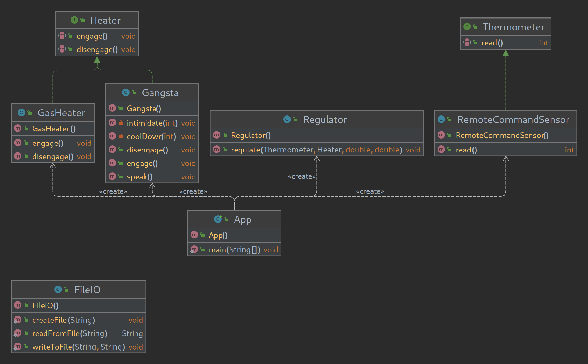

# To Regulate

## Nate Dogg and Warren G had to Regulate. Kata Programación DAW Dual
Ejercicio para practicar DIP. Crear un regulador que acepte un termometro y un calentador.  
Crea el programa con la ayuda del diagrama UML.   

Exercise to practice DIP. Create a regulator that accepts a thermometer and a heater.  
Create the program with the help of the UML diagram.  

## Key-Concepts :dart: 
- Singleton
- Abstraction
- DIP
- Interfaces
- G-Funk

## UML
